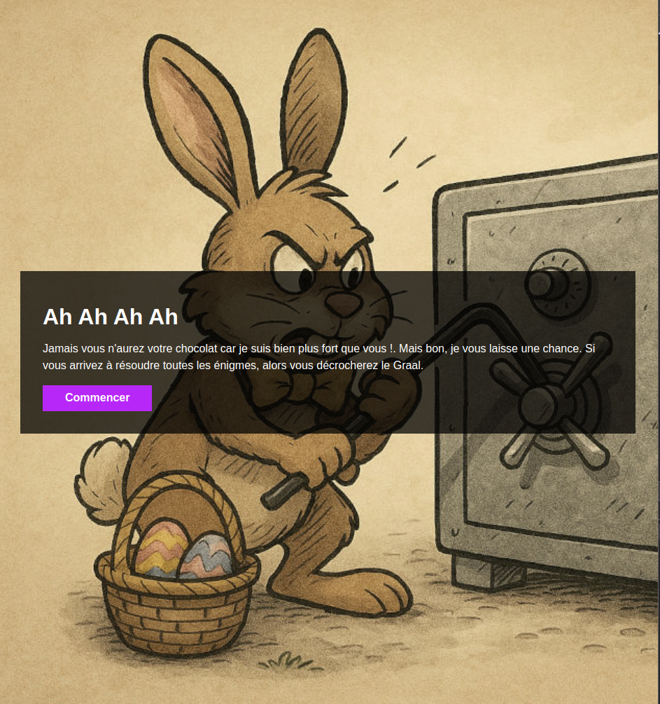
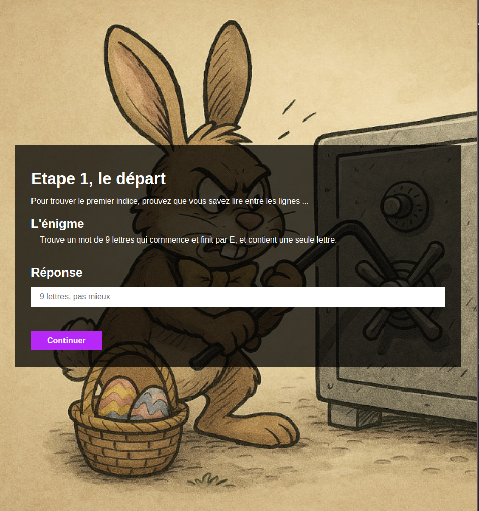
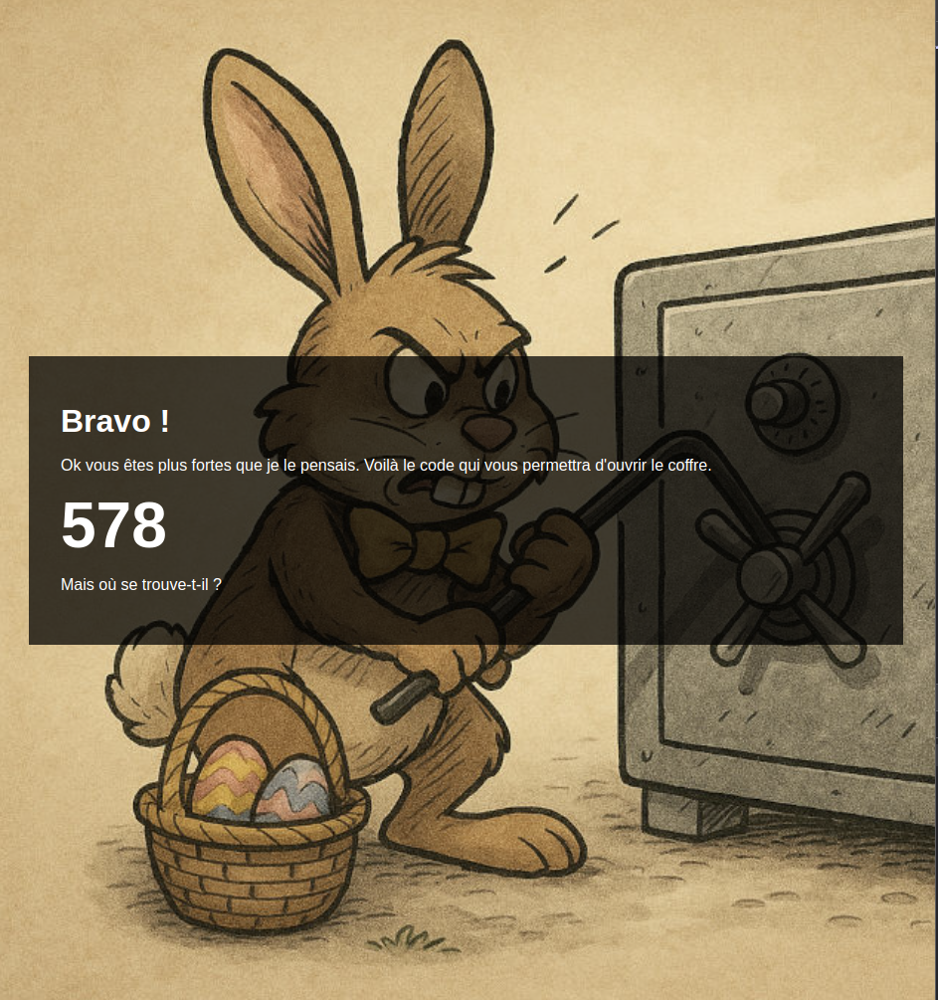

# Chasse aux oeufs

## Description
Voici une appli statique faite de page html qui s'enchainent les unes après les autres afin de dérouler les différentes énigmes de la chasse aux oeufs virtuelle.
Pratique lorsque vous habitez en appartement et que vos enfants commnencent à devenir grand.

## Comment utiliser
Clonez le répo, ensuite un petit `npm install` suivi d'un `npm run start` et un serveur local sera ouvert et disponible sur le réseau sur le port `8080`.
Vous pouvez éditer les pages de chaque étapes directement dans les fichiers `html` et ensuite mettre en place les checks dans le fichier `script.js`.

Et ensuite c'est parti ...

